# n8n-avatar-generator

1. Установить Docker на свой компьютер ([как это сделать](https://docs.docker.com/desktop/setup/install/mac-install/))
2. Создать папку "n8n"
3. Скачать в эту папку файл Dockerfile, docker-compose.yml (они лежат в этом репозитории рядом), либо склонировать этот репозиторий себе через git
4. Также в этой папке создать файл .env с содержимым 
```.env
GENERIC_TIMEZONE=Europe/Moscow # ваш часовой пояс
N8N_BASIC_AUTH_ACTIVE=true
N8N_BASIC_AUTH_USER=admin 
N8N_BASIC_AUTH_PASSWORD=strongpassword # пароль, какой хотите
```
5. Открыть папку в терминале
6. Запустить команду ```docker compose up --build -d```
8. Открыть в браузере http://localhost:5678/
9. Зарегистрироваться
10. Нажать "+" в верхнем левом углу -> Workflow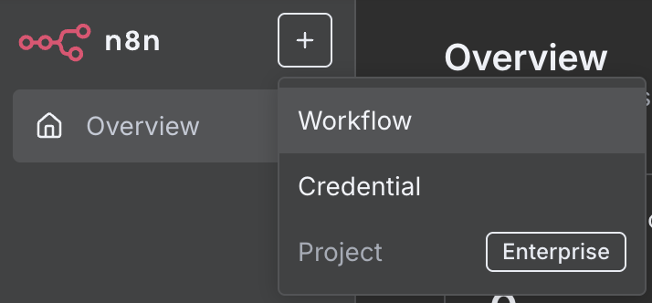
11. В левом нижнем углу нажать "..." -> Settings -> Community nodes -> Install a community node -> "@elevenlabs/n8n-nodes-elevenlabs" 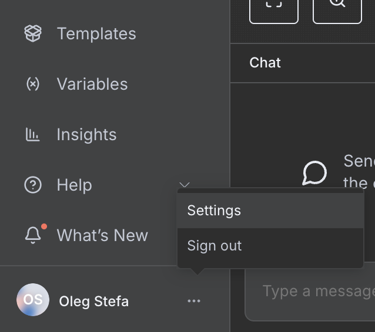
12. В правом верхнем углу нажать "..." -> Import from file -> Выбрать файл n8n-local.json (или n8n-telegram.json если запускаете на сервере и хотите задавать начальный промпт через телеграм бота)
13. Кликните 2 раза в ноду "Send a text message" и нажмите "Select Credential" -> "Create new credential"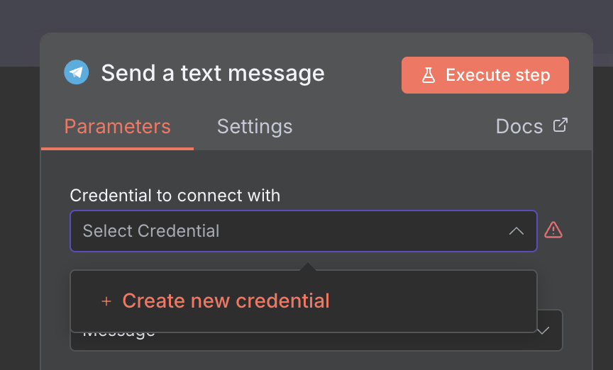
14. Вставьте Access token вашего бота, который вам дал @BotFather, нажмите save
15. Аналогичным образом кликните на ноду "Get titles" и добавьте Credentials, проставив в поле API Key ваш ключ от OpenRouter API, который можно сгенерировать на https://openrouter.ai. В base url введите https://openrouter.ai/api/v1. Нажмите save
16. Аналогичным образом настройте Credentials для HeyGen, нажав дважды на "Avatar list" и прописав Name "X-Api-Key", а Value = API ключ от HeyGen сгенерировав его тут https://app.heygen.com/settings?from=&nav=Subscriptions%20%26%20API. Чтобы не запутаться предлагаю назвать эту авторизацию "HeyGen" в левом верхнем углу (нужно зарегистрироваться)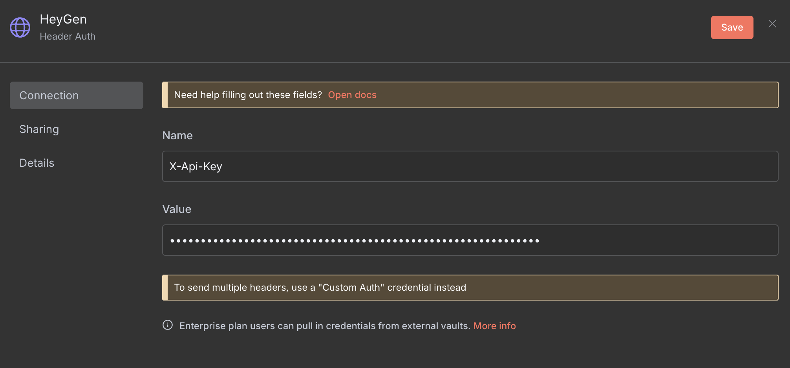
17. Аналогично настроить авторизацию для ноды "Transcribe audio or video", введя свой API ключ от ElevenLabs отсюда https://elevenlabs.io/app/settings/api-keys (нужно зарегистрироваться и купить минимальную подписку)
18. Затем нужно докинуть авторизацию для piapi, чтобы генерировать музыку в Udio. Откройте ноду "Generate udio song". Нажмите Header Auth -> Create new credential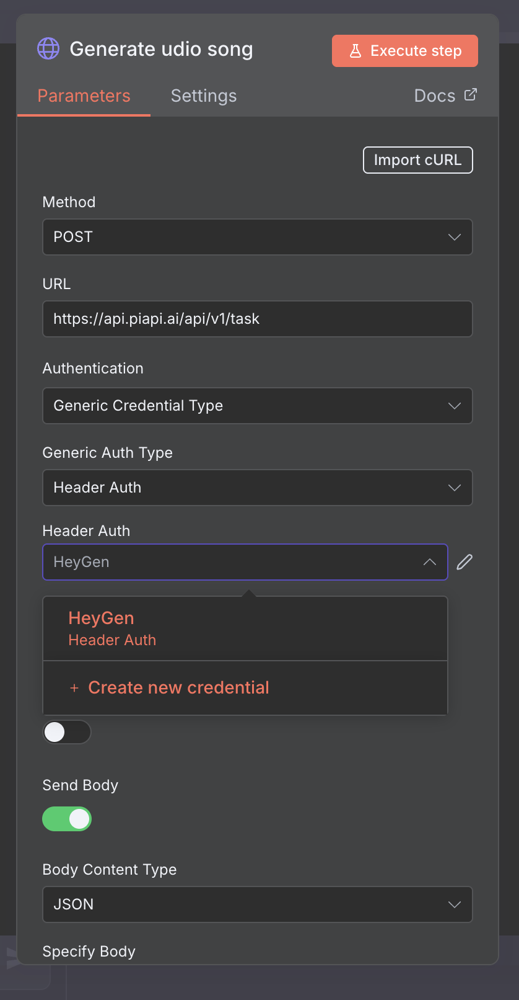
19. Проставьте X-API-KEY как Name и ваш API ключ от https://piapi.ai/workspace/key (нужно зарегистрироваться и пополнить минимально аккаунт). Эту авторизацию можно назвать PiApi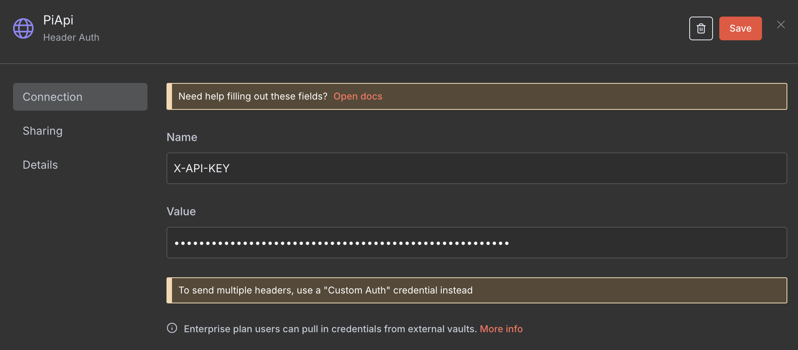
20. Проставить эту же авторизацию для ноды "Get udio song", выбрав ее в списке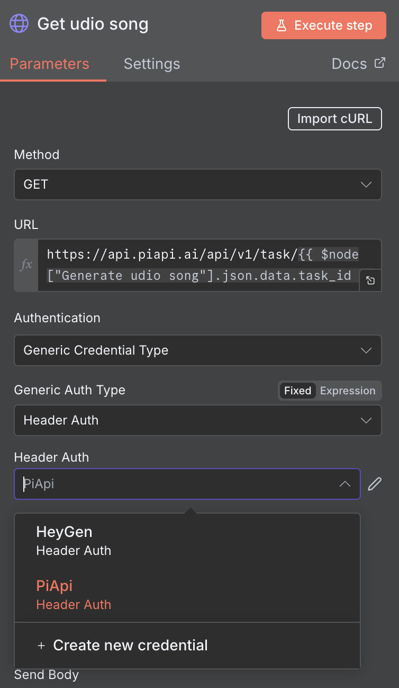
21. Настроить Credential для OpenAI ноды генерации изображений "Generate an image", дважды кликнув на нее и создав еще одни креды 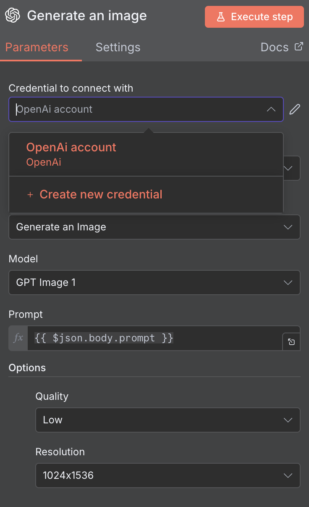
22. Прописать API Key, сгенерированный тут https://platform.openai.com/settings/organization/general (нужно зарегистрироваться и подтвердить организацию через паспорт тут https://platform.openai.com/settings/organization/general)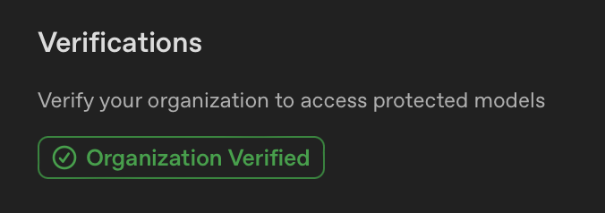
23. Создайте свой видео аватар на https://app.heygen.com/avatars
24. Склонируйте свой голос в Elevenlabs и подключите его к своему аватару, как я показываю в ютуб видео
25. Выполните ноду "Avatar list", нажав "Execute step", чтобы увидеть список своих аватаров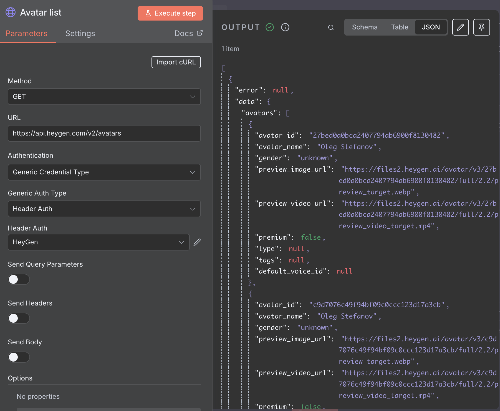
26. Найдите свой аватар по имени, скопируйте его avatar_id и вставьте в json ноды "video generation settings"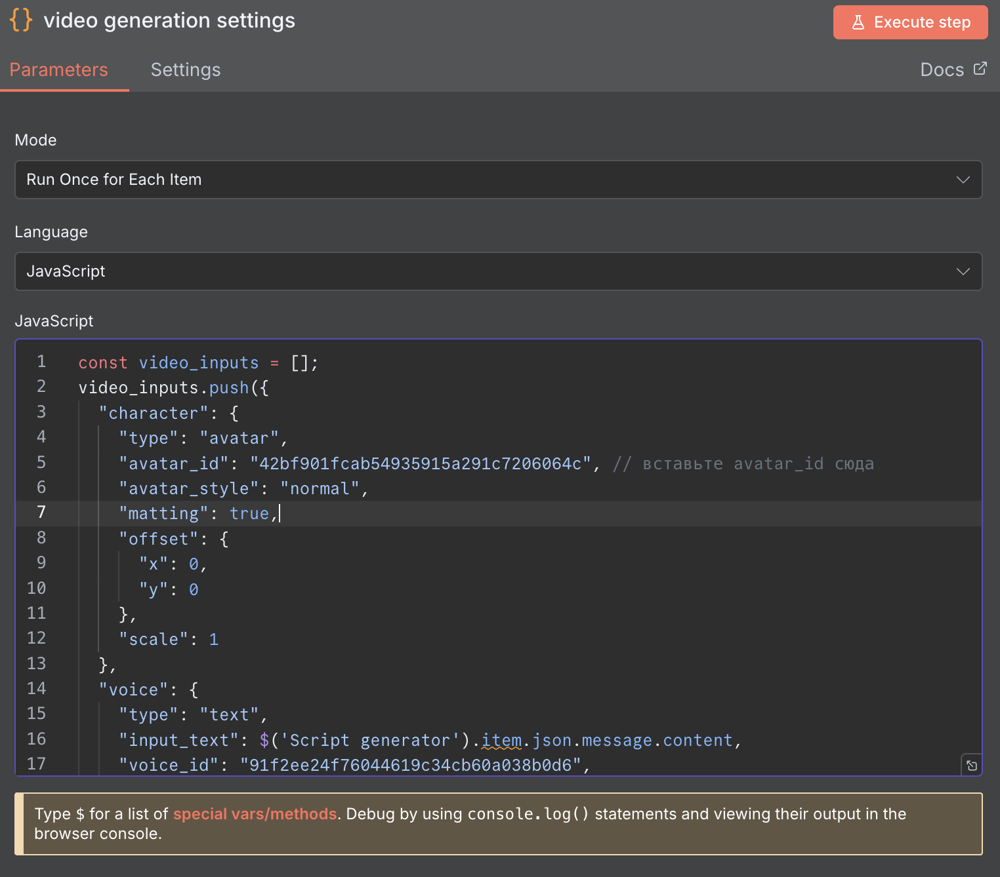
27. Аналогично сделайте с голосом, вызвав "Voices list" и затем заменив voice_id в json ноды "video generation settings"
28. Активируйте ваш workflow сверху 
29. Затем у самой первой ноды нажмите "Open chat"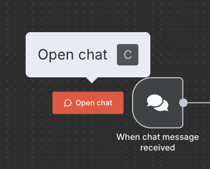
30. И теперь можете использовать генератор видео, вводя свою идею видео в открывшийся чат (если вы настраивали на сервере и использовали n8n-telegram.json, то пишите свою идеи в диалог с вашим телеграм ботом + не забудьте поставить свой telegram id в ноду "if it's from me", чтобы принимать сообщения только от вас, telegram id можно узнать у бота @userdatailsbot + замените localhost:5678 на ваш ip или домен в ноде "image generation web hook request")
31. Если что-то не работает, пишите сюда https://t.me/oleg_code в телеграм
